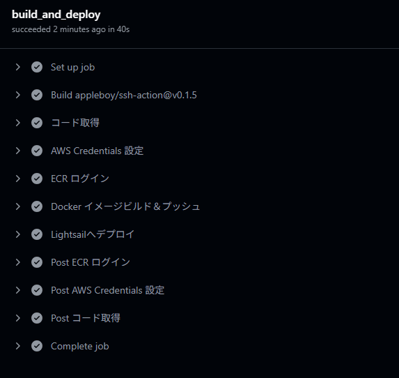
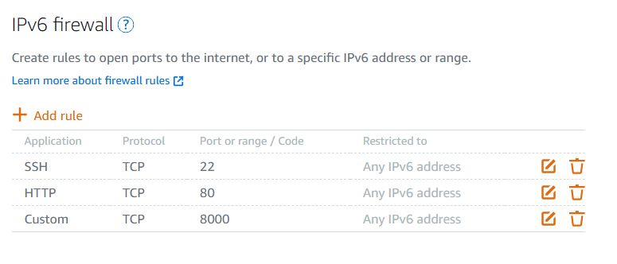

# GitHub Actions による自動デプロイ設定

## 1. 概要
- ビルド、ECRプッシュ、デプロイの一連の流れはdeploy.ymlファイルで設定する。deploy.ymlがプロジェクトにあればGitHUBのほうで自動でデプロイタスクが動き出す。


    
    Actionsの画面  
    リポジトリへのpushがトリガーとなって、ECR(dockerイメージ倉庫)へ接続し、そこでビルドを行い、ビルドしたイメージをLightsailへ送り、Lightsailで旧来のイメージを停止させて、新しいイメージを立ち上げる。この一連の流れが自動で行われる。

## 2. `.devcontainer/devcontainer.json`

```json
{
  "name": "web-app-template (py3.11)",
  "build": {
    "dockerfile": "Dockerfile"
  },
  "mounts": [
    "source=${localEnv:HOME}/data,target=/data,type=bind"
  ],
  "runArgs": [
    "-v",
    "${localEnv:HOME}/.gitconfig:/etc/gitconfig:ro",
    "--publish", "5678:5678",
    "--publish", "8000:8000",
    "--name", "web-app-template"
  ],
  "forwardPorts": [5678, 8000],
  "customizations": {
    "vscode": {
      "extensions": [
        "ms-python.python",
        "ms-python.black-formatter",
        "ms-python.isort",
        "ms-python.flake8",
        "GitHub.copilot",
        "GitHub.copilot-chat",
        "ms-toolsai.jupyter",
        "ms-python.debugpy"
      ],
      "settings": {
        "[python]": {
          "editor.defaultFormatter": "ms-python.black-formatter",
          "editor.formatOnSave": true,
          "editor.codeActionsOnSave": {
            "source.organizeImports": "explicit"
          }
        },
        "isort.args": ["--profile", "black"]
      }
    }
  },
  "remoteUser": "root"
}
```

## 3. `.devcontainer/Dockerfile`

```dockerfile
# ── 軽量な公式 Python イメージ ─────────────────────────
FROM python:3.11-slim

ARG DEBIAN_FRONTEND=noninteractive

WORKDIR /app

# ── システム依存パッケージのインストール ────────────────
RUN apt-get update \ 
 && apt-get install -y --no-install-recommends git \ 
 && rm -rf /var/lib/apt/lists/*

# ── コンテナがリッスンするポート ─────────────────────────
EXPOSE 8000 5678

# ── アプリケーションコードをコピー ───────────────────────
COPY . .

# ── デプロイ試験用ダミーコマンド ─────────────────────────
CMD ["python", "-m", "http.server", "8000"]
```

## 4. `.github/workflows/deploy.yml`

```yaml
name: CI/CD Pipeline

on:
  push:
    branches:
      - main

jobs:
  build_and_deploy:
    runs-on: ubuntu-latest

    steps:
      # コード取得
      - name: コード取得
        uses: actions/checkout@v3

      # AWS 認証情報設定
      - name: AWS Credentials 設定
        uses: aws-actions/configure-aws-credentials@v2
        with:
          aws-access-key-id:     ${{ secrets.AWS_ACCESS_KEY_ID }}
          aws-secret-access-key: ${{ secrets.AWS_SECRET_ACCESS_KEY }}
          aws-region:            ${{ secrets.AWS_REGION }}

      # ECR ログイン
      - name: ECR ログイン
        id: login-ecr
        uses: aws-actions/amazon-ecr-login@v1

      # Docker イメージビルド＆プッシュ
      - name: Docker イメージビルド＆プッシュ
        run: |
          IMAGE_TAG=${{ github.sha }}
          docker build             -f .devcontainer/Dockerfile             -t web-app-template:$IMAGE_TAG             .
          docker tag web-app-template:$IMAGE_TAG ${{ steps.login-ecr.outputs.registry }}/web-app-template:$IMAGE_TAG
          docker push ${{ steps.login-ecr.outputs.registry }}/web-app-template:$IMAGE_TAG
        env:
          DOCKER_BUILDKIT: 1

      # Lightsail へデプロイ
      - name: Lightsailへデプロイ
        uses: appleboy/ssh-action@v0.1.5
        with:
          host:     ${{ secrets.LIGHTSAIL_HOST }}
          username: ${{ secrets.LIGHTSAIL_USER }}
          key:      ${{ secrets.LIGHTSAIL_SSH_PRIVATE_KEY }}
          script: |
            IMAGE_TAG=${{ github.sha }}

            # AWS CLI インストール必須
            # 未インストールならば下記の要領でインストール
            # curl "https://awscli.amazonaws.com/awscli-exe-linux-x86_64.zip" -o "awscliv2.zip"
            # unzip awscliv2.zip
            # sudo ./aws/install

            aws ecr get-login-password --region ${{ secrets.AWS_REGION }}               | docker login --username AWS --password-stdin ${{ steps.login-ecr.outputs.registry }}

            docker pull ${{ steps.login-ecr.outputs.registry }}/web-app-template:$IMAGE_TAG

            # コンテナ名 web-app-template があるかどうかを調べ、
            # なければ何もしない
            if docker ps -a --format '{{.Names}}' | grep -w web-app-template > /dev/null; then
              docker stop web-app-template
              docker rm   web-app-template
            fi
            
            docker run -d               --restart unless-stopped               -p 8000:8000 -p 5678:5678               --name web-app-template               ${{ steps.login-ecr.outputs.registry }}/web-app-template:$IMAGE_TAG
```

## 5. つまづきポイント・注意喚起

1. **Dockerfile の位置**
   - `.devcontainer/Dockerfile` を明示的に `-f` オプションで指定しないとビルドエラーになる。

2. **Lightsail 側 SSH 実行時の変数定義**
   - `IMAGE_TAG` が未定義だと `invalid reference format` エラーに。SSH スクリプト内で `${{ github.sha }}` を定義する必要あり。

3. **AWS CLI の未インストール**
   - Lightsail インスタンスに AWS CLI がない場合、`aws: command not found` エラーが発生。インストール手順をコメントに追記済み。

4. **LightSailでの pull エラー**
   - 現在、`docker pull` 実行時にエラーが発生中。【次フェーズで対処】

5. **データベースファイルの事前準備**
   - デプロイ前に、Lightsailインスタンス上で以下のコマンドを実行してデータベースファイルを作成する必要があります：
   ```bash
   mkdir -p /home/ubuntu/server_secrets
   touch /home/ubuntu/server_secrets/server_web_app.db
   ```
   - このファイルが存在しない場合、Dockerのボリュームマウント機能により自動的にディレクトリが作成されてしまう可能性があります。

以上の内容を Phase 3-1 としてまとめました。

## 6 AWS CLI のインストール

Windows の場合
1. AWS公式サイトから MSI インストーラーをダウンロード
2. ダブルクリックしてウィザードに従いインストール

macOS の場合
```
brew install awscli
```

Linux（WSL2含む）の場合
```
curl "https://awscli.amazonaws.com/awscli-exe-linux-x86_64.zip" -o "awscliv2.zip"
unzip awscliv2.zip
sudo ./aws/install
```

バージョン確認
```
aws --version
# 例: aws-cli/2.x.x Python/3.x.x Linux/4.x.x exe/x86_64

```


## 7. ECR（ドッカーイメージ保存倉庫）アクセスのためのIAMロール追加とLightsailに権限付与
1. AWSコンソールの IAM → ユーザー で新規ユーザーを作成  
**名前は```ecr-deployer```にした**    
**このユーザーにできること:ECRへのイメージプッシュ／プル**  
  グループ名は先ほどのユーザー名に合わせて例えば ecr-deployer-group
2. 「プログラムによるアクセス」のみ有効化  
CI/CD用のIAMユーザーであれば、プログラムによるアクセス（API/CLI）だけを許可  ――もし将来的に人がコンソールから直接操作する必要が出てきた場合は、そのときに「コンソールアクセスを有効化」し、初回サインイン時にパスワード変更を必須 MFA（多要素認証）を併用などのセキュリティ設定を追加する


3. ポリシーで AmazonEC2ContainerRegistryFullAccess（または必要最小限のECR操作権限）をアタッチ

4. アクセスキーID／シークレットアクセスキーをダウンロード

5. **LightSail側で**認証情報設定
    ```
    aws configure
    # AWS Access Key ID [None]: <アクセスキーID>
    # AWS Secret Access Key [None]: <シークレットアクセスキー>
    # Default region name [None]: ap-northeast-1
    # Default output format [None]: json
    ```
6. 権限・接続確認
    ```
    aws sts get-caller-identity
    ```
7. ECR作成
    ```
    aws ecr create-repository --repository-name web-app-template --region ap-northeast-1
    ```
8. ECR確認

    - AWSコンソールにサインイン
    - サービス検索バーに「ECR」または「Elastic Container Registry」と入力して選択
    - 左側ナビゲーションの**「リポジトリ」**をクリック

    - 右上のリージョンが**ap-northeast-1（東京リージョン）**になっていることを確認

    - 一覧に**web-app-template**が表示されていれば、リポジトリの作成が成功しています

## 8. GitHub Actionsの動作準備
リポジトリページを開き、「Settings」→「Secrets and variables」→「Actions」を選択  
「New repository secret」をクリックし、以下の６つを登録してください

- AWS_ACCESS_KEY_ID	IAMユーザーのアクセスキーID（例: AKIA…）
- AWS_SECRET_ACCESS_KEY	IAMユーザーのシークレットアクセスキー（例: wJalr…）
- AWS_REGION	ap-northeast-1
- LIGHTSAIL_SSH_PRIVATE_KEY	Lightsail接続用の秘密鍵（PEM形式ファイルの中身をコピー）
- LIGHTSAIL_HOST	LightsailインスタンスのパブリックIP（例: 13.XX.XX.XX）
- LIGHTSAIL_USER	SSHユーザー名（例: ubuntu）

## 9. Lightsail　静的IP
静的IPを割り当てた場合、先にインスタンスを消すと静的IPが浮いてしまう。この浮いた静的IPに対して月５００円くらいの課金が発生するため注意が必要（一応GoogleCalenderとGPTにリマインドしてもらうよう設定した）

## 10. Lightsail　ポート開放
なお今後の開発で必要なポートは開けておく。Dockerfileの最後で```CMD ["python", "-m", "http.server", "8000"]```を実行しているので下記のように8000番を開けておく。


## 11. 動作確認
```http://<LightsailのIPアドレス>:8000/```
にアクセスするとディレクトリ情報が返ってくる。


